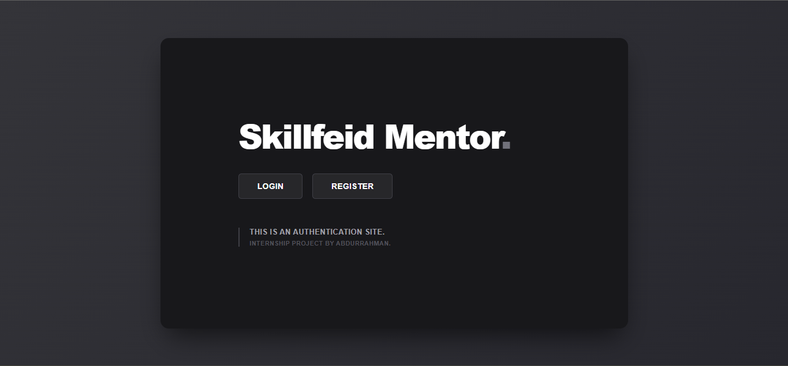
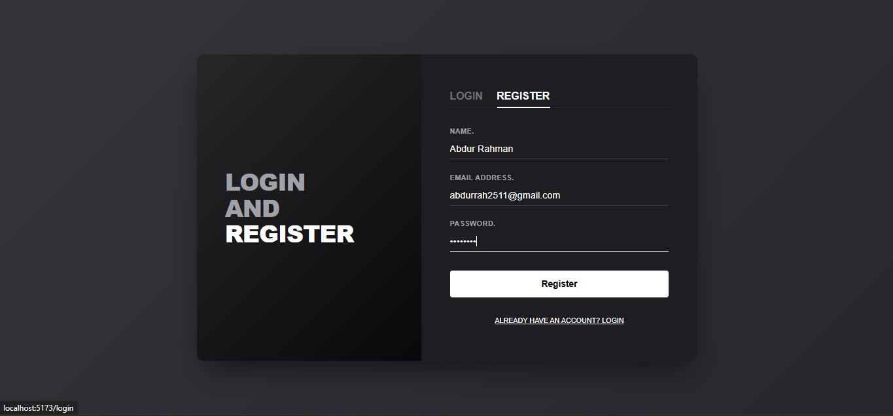
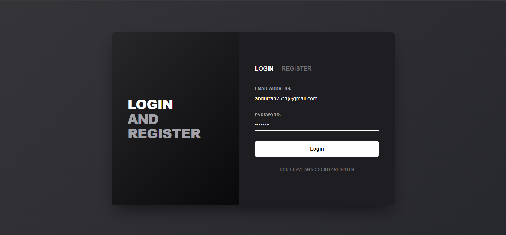
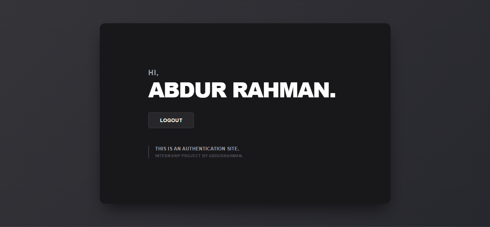

# 🔐 MERN Authentication System

A simple full-stack authentication system built with the MERN stack where users can register, log in, and access a personalized homepage after authentication.

---

## ✨ Features
### 👤 Authentication
- User Registration
- User Login
- Logout functionality
- JWT-based authentication
- Protected routes

### 🏠 Home Page
- Landing page with title & footer
- Login and Register buttons
- Redirect after authentication
- Personalized welcome message with signed-in username

### 🎨 UI Features
- Clean responsive design
- React Router navigation
- Form validation
- Authentication state handling

---

## 🛠️ Tech Stack
### Frontend
- React.js
- React Router DOM
- Axios
- CSS

### Backend
- Node.js
- Express.js

### Database
- MongoDB (MongoDB Atlas)

### Authentication
- JWT (JSON Web Token)
- bcrypt.js

### Deployment
- Frontend: Netlify / Vercel
- Backend: Render

---

## 📂 Project Structure
```bash

mern-auth-app/
│
├── backend/
│ ├── models/
│ ├── routes/
│ ├── middleware/
│ ├── controllers/
│ └── server.js
│
├── frontend/
│ ├── src/
│ │ ├── pages/
│ │ ├── components/
│ │ ├── context/
│ │ ├── App.jsx
│ │ └── main.jsx
│
└── README.md

```

---

## 🧪 How to Run Locally

### 🔧 Backend
- cd backend
- npm install
- npm run dev

### 🌐 Frontend
- cd frontend
- npm install
- npm run dev

---

## 🔄 Application Flow
- User lands on the homepage
- User clicks Login or Register
- User authenticates successfully
- JWT token is generated and stored
- User is redirected to the main page
- Homepage title changes to the signed-in username
- User can logout anytime

---

## 📸 Screenshots

### 🏠 Home Initial Page


### 🃏 Register Page


### 🃏 Login Page


### 🛒 Home After Page


---

## 🔮 Future Improvements
- Password reset functionality
- Email verification
- Light mode
- Google authentication
- Protected dashboard

## 🧠 What I Learned
- MERN stack fundamentals
- JWT authentication flow
- React state management
- Protected routes in React
- Backend API integration
- MongoDB database operations

## 📬 Contact
If you like this project or want to collaborate:
GitHub: https://github.com/your-username

## ⭐ Give a Star
If you found this project helpful, consider giving it a ⭐